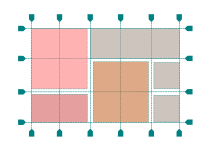

# Grid Layout (CSS) for Flutter

[](https://github.com/lyskouski/flutter_grid_layout/actions/workflows/test.yml)
[](https://github.com/lyskouski/flutter_grid_layout/actions/workflows/build.yml)
<a href="https://www.buymeacoffee.com/lyskouski"></a>



Embracing a grid layout is essential for creating adaptable and user-friendly digital designs. Grids ensure visual consistency, prioritize content, and seamlessly adapt to various screen sizes, enhancing the overall user experience across devices and displays.

## Features

- Basic implementation of [CSS Grid](https://css-tricks.com/snippets/css/complete-guide-grid/).

## Getting started
https://pub.dev/packages/flutter_grid_layout

```bash
flutter pub add flutter_grid_layout
```

## Simple Sample

```dart
GridContainer(
  columns: [0.2, null, 0.2],
  rows: [0.2, null, 0.2],
  children: [
    GridItem(
      start: const Size(1, 1),
      end: const Size(2, 2),
      child: Container(color: Colors.red),
    )
  ],
),
```


## Multiple Items with different layers

```dart
GridContainer(
  columns: [0.2, 0.3, 0.3, 0.2],
  rows: [0.2, 0.3, 0.3, 0.2],
  children: [
    GridItem(
      start: const Size(0, 0),
      end: const Size(4, 1),
      child: Container(color: Colors.red),
    ),
    GridItem(
      start: const Size(1, 0),
      end: const Size(3, 4),
      order: 1,
      child: Container(color: Colors.blue.withOpacity(0.5)),
    ),
    GridItem(
      start: const Size(2, 3),
      end: const Size(4, 4),
      child: Container(color: Colors.green),
    ),
  ],
),
```


## Reversed Multiple Items with different layers

```dart
GridContainer(
  alignment: MainAxisAlignment.end,
  columns: [0.2, 0.3, 0.3, 0.2],
  rows: [0.2, 0.3, 0.3, 0.2],
  children: [
    GridItem(
      start: const Size(0, 0),
      end: const Size(4, 1),
      child: Container(color: Colors.red),
    ),
    GridItem(
      start: const Size(1, 0),
      end: const Size(3, 4),
      order: 1,
      child: Container(color: Colors.blue.withOpacity(0.5)),
    ),
    GridItem(
      start: const Size(2, 3),
      end: const Size(4, 4),
      child: Container(color: Colors.green),
    ),
  ],
),
```


In addition to thanking, you may [treat us to :coffee:](https://www.buymeacoffee.com/lyskouski).
